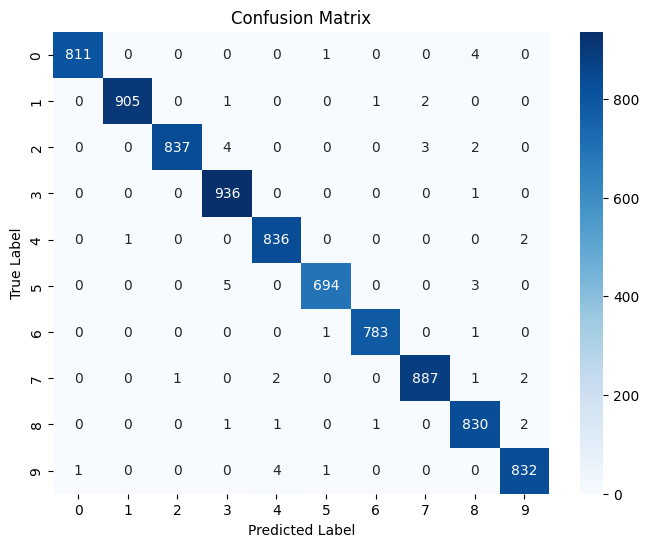

# DNSC 3288 - Group-7 Model Card
### Basic Information
* **Person or organization developing model**:
  * Eleanor Bain, `eleanor.bain@gwmail.gwu.edu`
  * Ivana Edward, `ivana.edward@gwmail.gwu.edu`
  * Kareena Singh, `ksingh67@gwu.edu`
  * Melody Vadnais, `melodyv@gwu.edu`
* **Model date**: December, 2025
* **Model version**: 1.0
* **License**: MIT
* **Model implementation code**: [DNSC_3288_Group_7_Number_Recognizer.ipynb](https://github.com/eleanorbain/Ethics-Group-7/blob/main/DNSC_3288_Group_7_Number_Recognizer.ipynb)

### Intended Use
* **Primary intended use**: This model is designed to classify written arabic numerals given their binary pixels in a 28x28 grid.
* **Primary intended users**: Students in GWU DNSC 3288 and other educational users.
* **Out-of-scope use cases**: Any non-educational use is out of scope.

* ### Training Data

* Data dictionary: 

| Name | Modeling Role | Measurement Level| Description|
| ---- | ------------- | ---------------- | ---------- |
|**label**| Target | int (nominal) | Digit label (0-9) |
| **pixel0** | Feature | int (ratio) | Pixel intensity (0-255) |
| **pixel1** | Feature | int (ratio) | Pixel intensity (0-255) |
| **pixel2** | Feature | int (ratio) | Pixel intensity (0-255) |
| **pixel3** | Feature | int (ratio) | Pixel intensity (0-255) |
...
| **pixel779** | Feature | int (ratio) | Pixel intensity (0-255) |
| **pixel780** | Feature | int (ratio) | Pixel intensity (0-255) |
| **pixel781** | Feature | int (ratio) | Pixel intensity (0-255) |
| **pixel782** | Feature | int (ratio) | Pixel intensity (0-255) |
| **pixel783** | Feature | int (ratio) | Pixel intensity (0-255) |

* **Source of training data**: Kaggle: [https://www.kaggle.com/competitions/digit-recognizer/overview](https://www.kaggle.com/competitions/digit-recognizer/data)
* **How training data was divided into training and validation data**: 80% training, 20% validation
* **Number of rows in training and validation data**:
  * Total rows: 42,000
  * Training rows: 33,600
  * Validation rows: 8,400
 
### Test Data
* **Source of test data**: Kaggle: [https://www.kaggle.com/competitions/digit-recognizer/overview](https://www.kaggle.com/competitions/digit-recognizer/data)
* **Number of rows in test data**: 28,000
* **State any differences in columns between training and test data**: The training dataset contains a column with the digit's 'true' label and the test dataset does not. Predictions made using the test dataset were submitted to Kaggle for evaluation.


### Model details
* **Columns used as inputs in the final model**: 'pixel0', 'pixel1', 'pixel2', 'pixel3', 'pixel4', 'pixel5', 'pixel6', 'pixel7', 'pixel8', 'pixel9',	… 'pixel774', 'pixel775', 'pixel776', 'pixel777', 'pixel778', 'pixel779', 'pixel780', 'pixel781', 'pixel782', 'pixel783'
* **Column(s) used as target(s) in the final model**: 'label'
* **Type of model**: Convolutional Neural Network
* **Software used to implement the model**: Python, Tensorflow (Keras)
* **Version of the modeling software**: Keras: 3.10.0
* **Hyperparameters or other settings of your model**: 
```
#Augmenting the Data to improve model performance
datagen = keras.preprocessing.image.ImageDataGenerator(
    rotation_range=10,
    width_shift_range=0.1,
    height_shift_range=0.1,
    shear_range=0.1,
    zoom_range=0.1
)
datagen.fit(train_images)

#Setting model hyperparameters
inputs = keras.Input(shape=(28, 28, 1))
x = layers.Conv2D(filters=128, kernel_size=3, activation="relu")(inputs)
x = layers.MaxPooling2D(pool_size=2)(x)
x = layers.Conv2D(filters=128, kernel_size=3, activation="relu")(x)
x = layers.MaxPooling2D(pool_size=2)(x)
x = layers.Conv2D(filters=128, kernel_size=3, activation="relu")(x)
x = layers.Flatten()(x)
outputs = layers.Dense(10, activation="softmax")(x)
model = keras.Model(inputs=inputs, outputs=outputs)

#Compiling the model
model.compile(optimizer="rmsprop",
    loss="sparse_categorical_crossentropy",
    metrics=["accuracy"])

#Fitting the model
model.fit(datagen.flow(train_images, train_labels, batch_size=64),
          epochs=10)
```

### Quantitative Analysis

* Models were assessed primarily with Accuracy and AUC. See details below:

| Train Accuracy | Validation Accuracy | Test Accuracy |
| ------ | ------- | -------- |
| 0.9883 | 0.9942  | 0.9921 |
* *Test accuracy can be found [here](https://www.kaggle.com/competitions/digit-recognizer/leaderboard) by searching up the name 'Eleanor Bain'*

AUC Summary:
* Macro AUC: 1.00
* Micro AUC: 1.00
* Per-class AUC:
  * Class 0: 1.0000
  * Class 1: 1.0000
  * Class 2: 1.0000
  * Class 3: 1.0000
  * Class 4: 1.0000
  * Class 5: 1.0000
  * Class 6: 1.0000
  * Class 7: 1.0000
  * Class 8: 1.0000
  * Class 9: 1.0000

#### Confusion Matrix



Figure 1. Confusion matrix for predicted vs. true classes. 

### Ethical Considerations
* **Potential Negative Impacts of Use:**
  * Model may be used for nefarious purposes such as unauthorized authorization or fraud processes.
  * Model may be used out of scope in high-risk scenarios and cause detriment to clients or other relevant parties when it predicts incorrectly.
* **Potential Uncertainties of Impact:**
  * Model may struggle to correctly understand handwritings with regional difference from the United States (the dataset’s origin) and have a worse validity.
  * Model may perform worse in untested environments, such as ones with excess or little light.
* **Unexpected Results:**
  * Model performance may vary slightly from reported accuracy in new environments due to the absence of a fixed random seed, which limits full reproducibility.
  * Model achieved an AUC of 1.00 on the provided dataset, indicating potential overfitting.
